# SPRAWOZDANIE z laboratorium nr 4
* Piotr Patek 324879
* Kacper Bielak 324852

# Zadanie 1
Analiza struktury systemu robota TIAGo (rviz,rqt_tf_tree,rqt_graph,narzędzia: topic, node, doctor-report).

Uruchomiono system robota TIAGo z wykorzystaniem komendy
```bash
ros2 launch hello_moveit stero_tiago_gazebo.launch.py is_publi_sim:=True navigation:=True moveit:=True world_name:=stero
```

Jak można zauważyć wykorzystano plik uruchomieniowy `stero_tiago_gazebo.launch.py` stworzony w ramach pakietu `hello_moveit` w trakcie bloku manipulacyjnego.
## Rviz
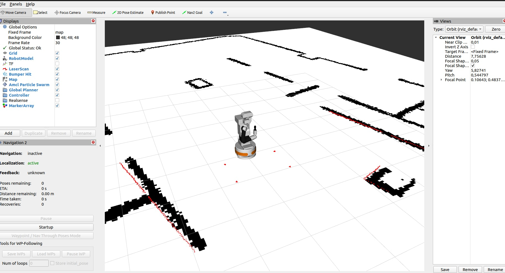

Pierwszym z badanych narzędzi był program do wizualizacji systemu - `RViz`. Służy on do reprezentacji obecnego stanu robota i tego jak postrzega on środowisko w którym się znajduje. Jak można zauważyć na rysunku widoczna jest mapa środowiska, w której przeszkody reprezentowane są jako czarne elementy. Dodatkowo widoczna jest chmura czerwonych punktów stworzona przez LIDAR 2D umieszczony w bazie robota. Dzięki niemu robot wie, że oprócz ścian o których istnieniu wiedział już z mapy, w świecie znajdują się także inne przeszkody takie jak stół, którego nogi widoczne są na rysunku.

Oprócz tego w programie możliwa jest modyfikacja widoków po lewej stronie (np. włączenie widoku TF, włączenie markerów) oraz zmiana orientacji kamery po rozwinięciu menu po prawej stronie.

## rqt_tf_tree

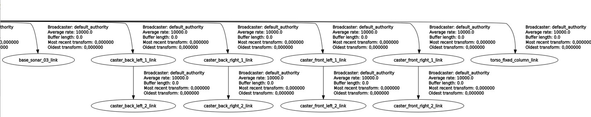
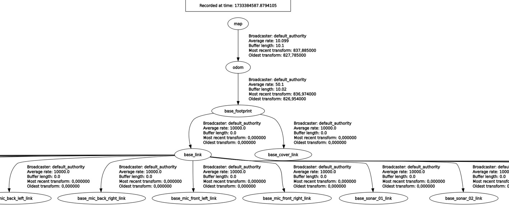
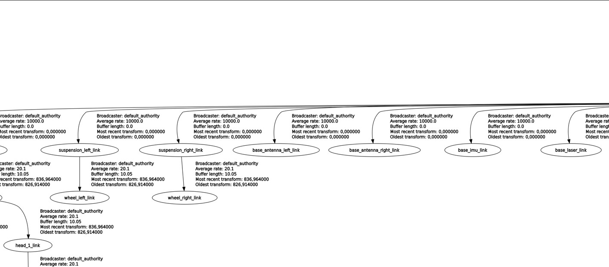
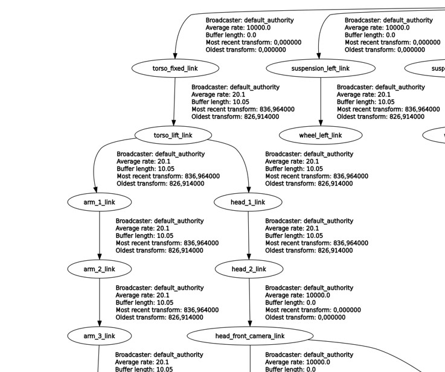
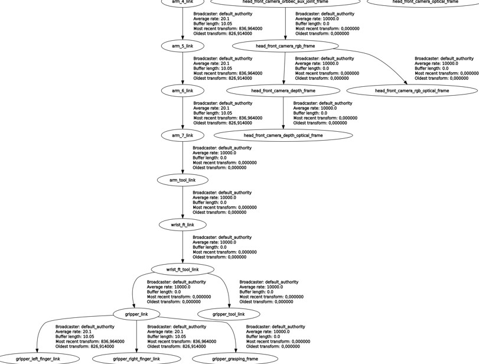

W następnym kroku skupiono się na drzewie transformacji TF, które wyświetlono z wykorzystaniem narzędzia `rqt_tf_tree`. Jak widać na rysunkach drzewo przekształceń jest bardzo obszerne. Jego korzeń znajduje się w układzie `map` związanym z mapą świata. Następnie widoczne są przekształcenia, aż do układu `base_link`, który jest glównym układem związanym z samym robotem. Bezpośrednio do niego przyłączone jest wiele układów, z czego większość to układy związane z różnymi czujnikami takimi jak mikrofony, sonary, LIDAR czy jednostka inercyjna. Po lewej stronie grafu widoczna jest dalsza część drzewa przekształceń zawierająca układ korpusu, który ostatecznie rodziela się na graf układów ramienia oraz układy związane z głową robota.

To co jest także istotne to fakt, że dla każdego układu na grafie możemy odczytać takie informacje jak częstotliwośc publikacji współrzędnych układu, wielkość bufora zawierającego jego poprzednie wartości czy nazwę elementu publikującego dany układ.

## rqt_graph

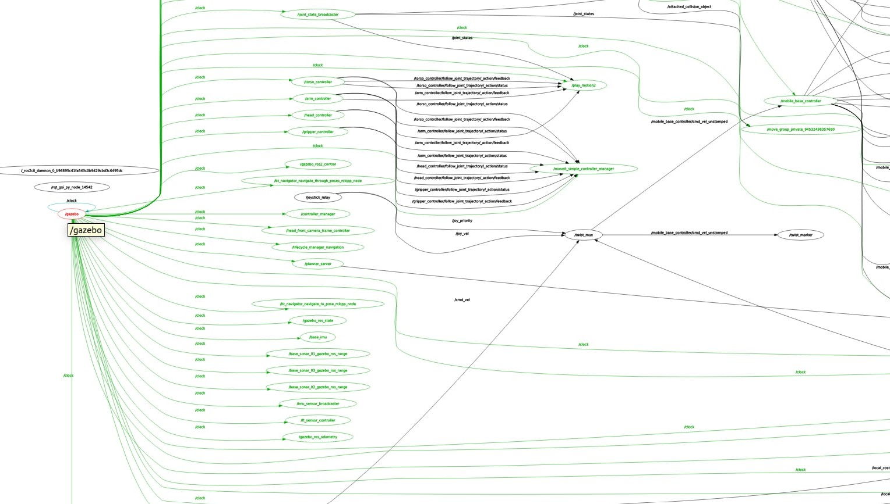
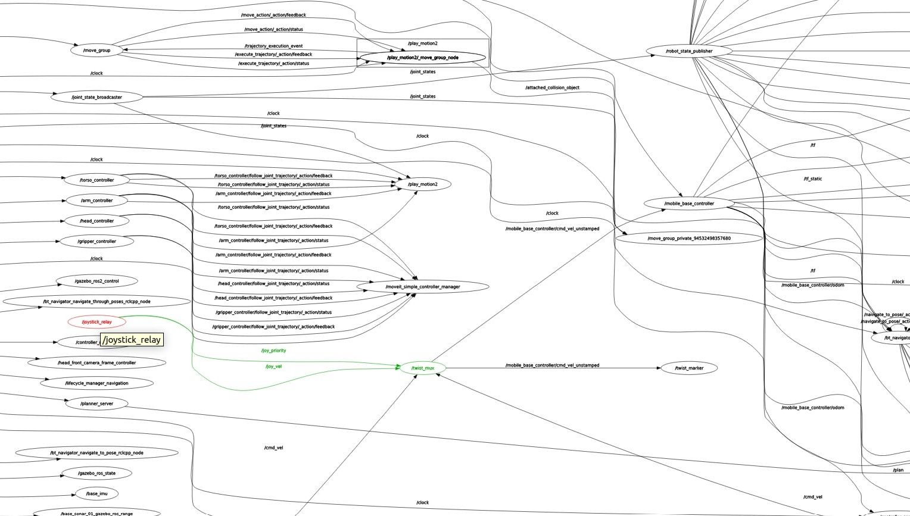
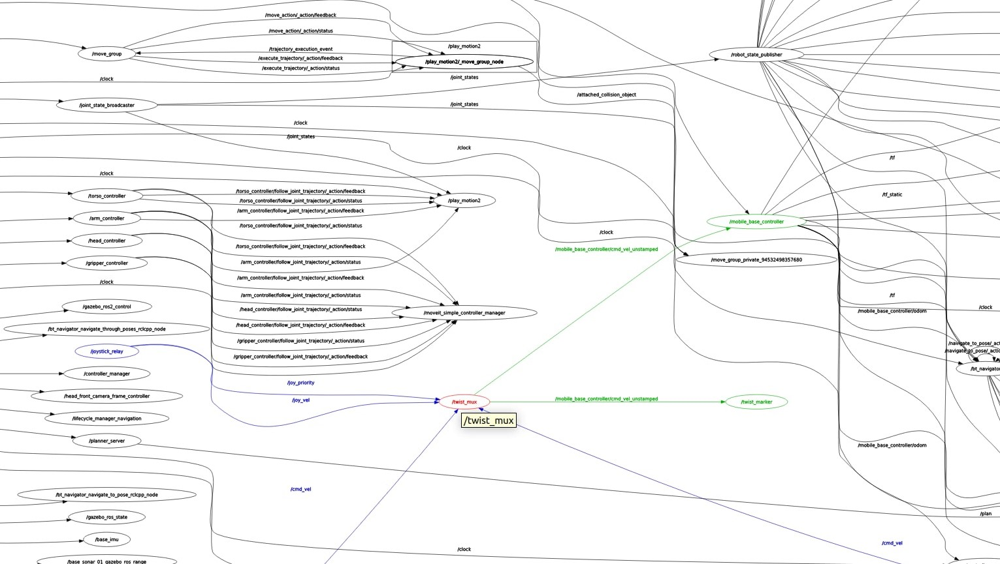
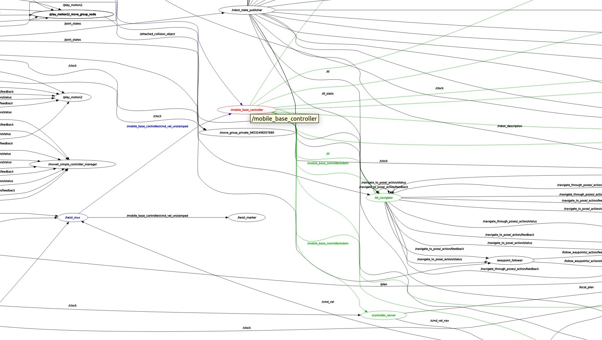
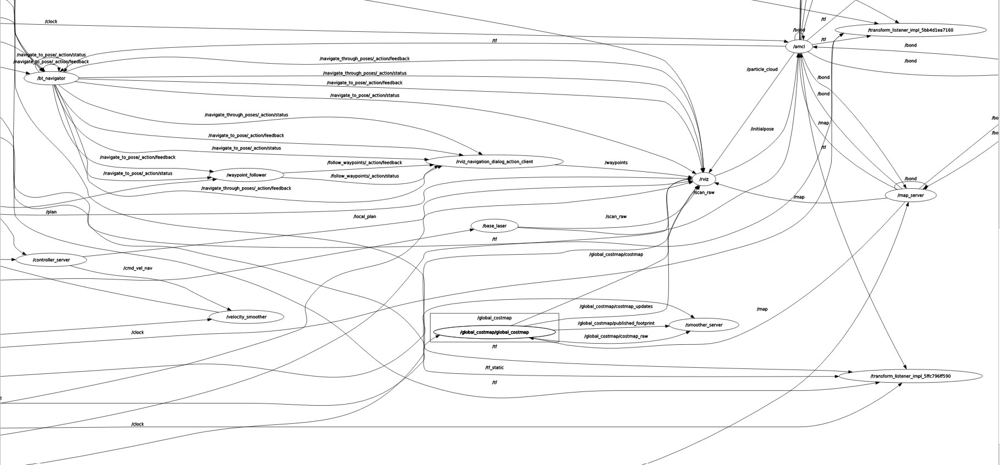
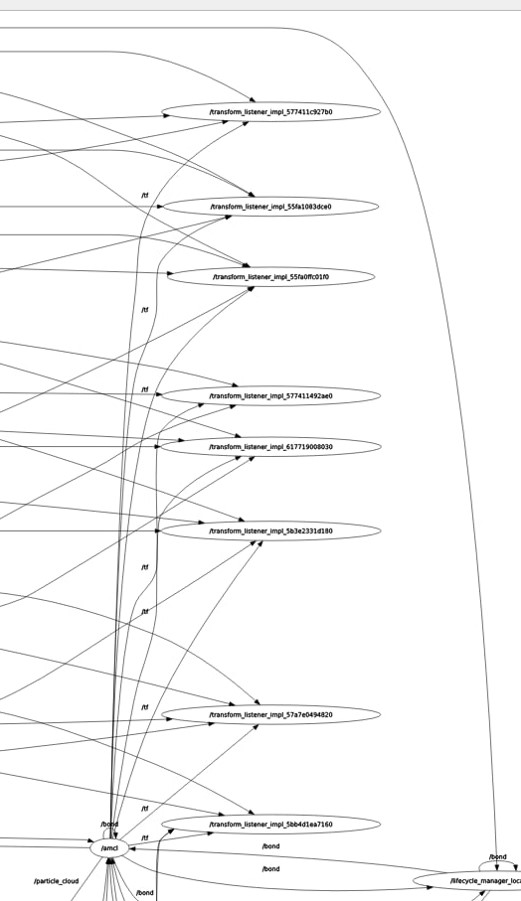

Po uruchomieniu programu `rqt_graph` wyświetlony został graf węzłów występujących w badanym systemie wraz z połączeniami między nimi. Jak można zauważyć rozważany system jest bardzo rozbudowany. Widoczne są węzły odpowiedzialne zarówno za samo sterowanie bazą mobilną - `mobile_base_controller` oraz węzły będące elementami systemu nawigacji - `bt_navigator`, `velocity_smoother`, `waypoint_follower` czy `global_costmap`.

Oprócz tego widoczne są także węzły odpowiedzialne za przełączanie pomiędzy różnymi strumieniami sterowania bazą mobilną, węzły czujników czy węzły systemów transformacji.

Z racji, że badany system działa w środowisku symulowanym nie mogło także zabraknąć elementu związanego z symulacją. W tym przypadku z lewej strony grafu widać węzeł `gazebo`.

## Narzędzia:
### Topic
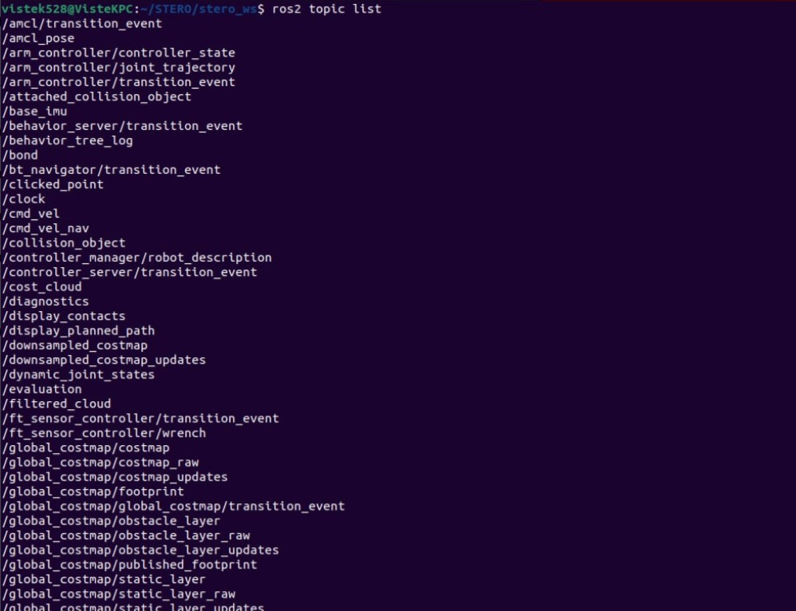
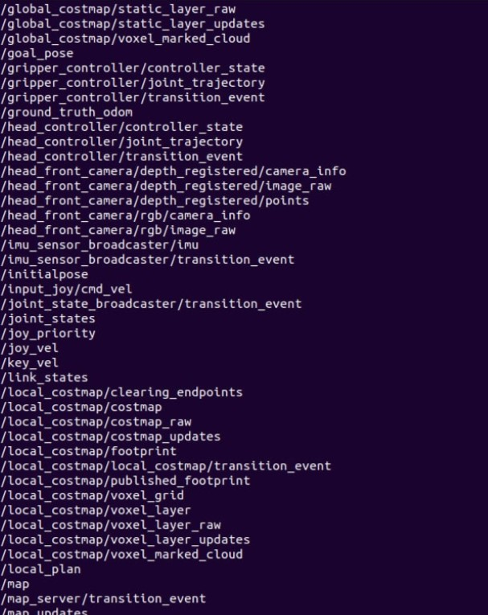
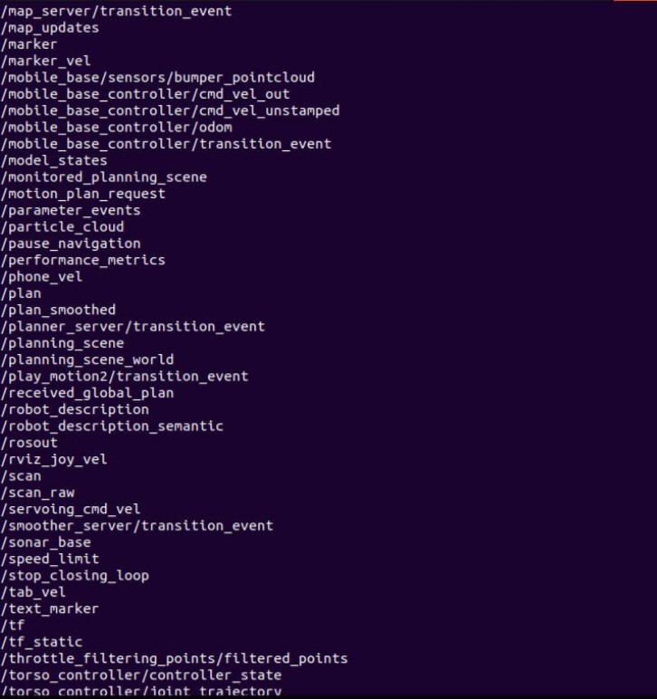
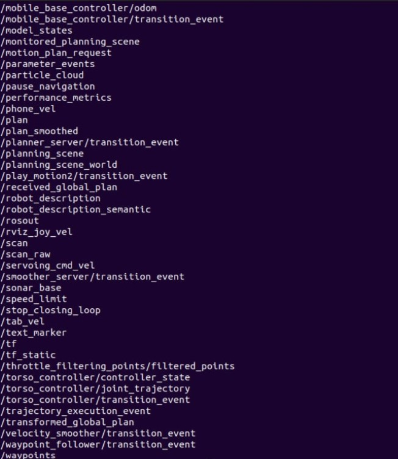

Listę tematów, które wcześniej ukazane były jako połączenia między węzłami na grafie `rqt_graph` można wyświetlić poleceniem `ros2 topic list`. Ukazuje się nam wtedy bardzo długa lista tematów, z których można wyróżnić m.in.:
- `/cmd_vel` - zadawanie prędkości bazy mobilnej
- `/base_imu` - orientacja robota
- `/scan_raw` - chmura punktów generowana przez LIDAR
- `/global_costmap/costmap` - mapa kosztów
- `/tf` - transformacje
- `/clock` - zegar symulacji

Lista pokazuje przepływ danych między węzłami odpowiedzialnymi za sterowanie, percepcję, planowanie i diagnostykę robota.
### Node
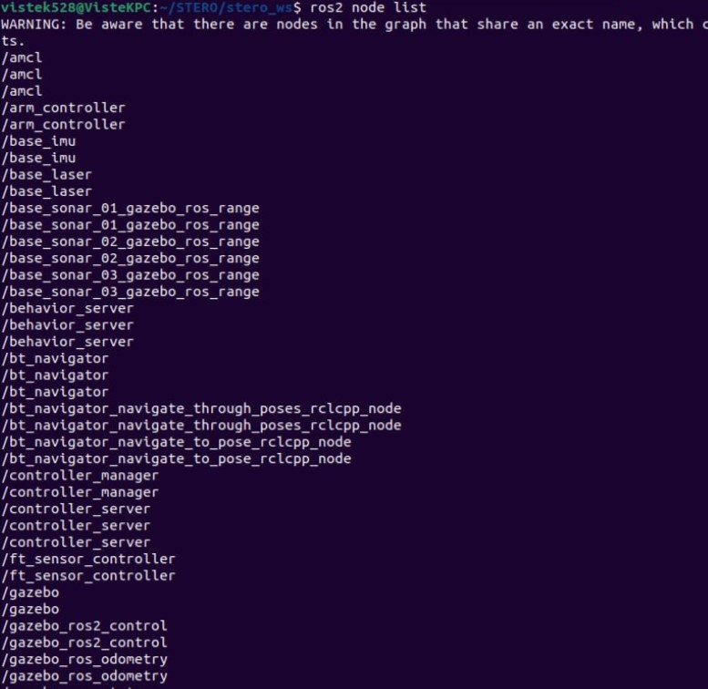
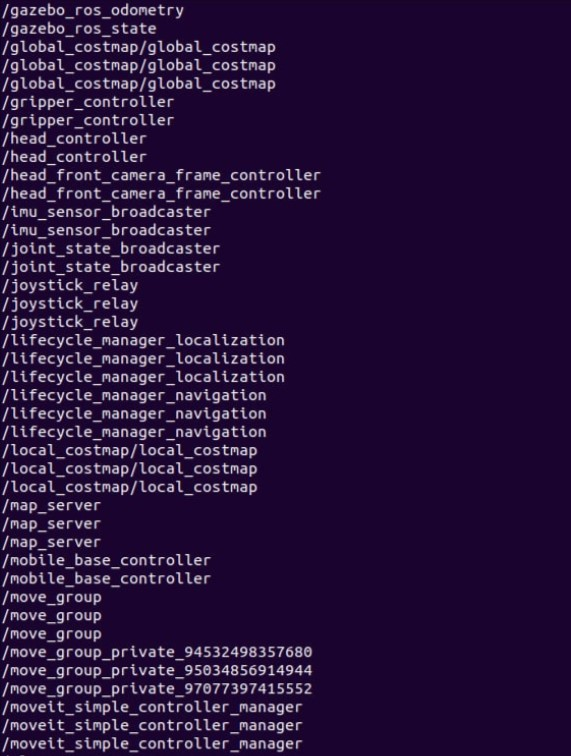
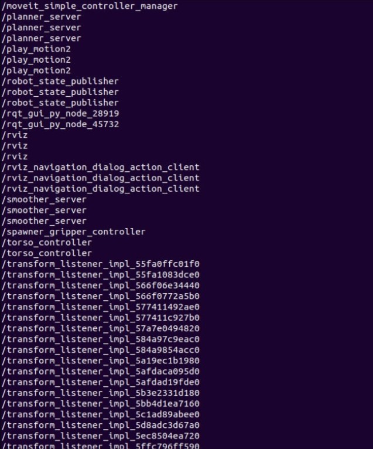
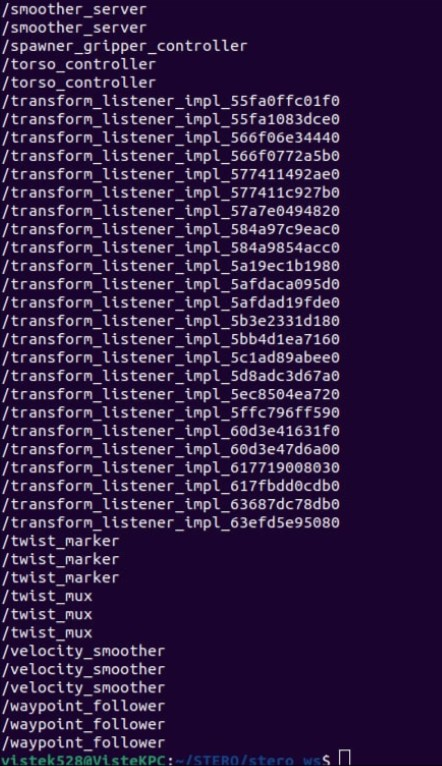

Komenda `ros2 node list` umożliwia wyświetlenie listy węzłów występujących w badanych systemie. Wyróżnić możemy m.in.:

- `gazebo` - symulacja
- `bt_navigator`, `amcl` - nawigacja
- `base_imu`, `base_laser` `base_sonar0*` - czujniki
- `head_controller`, `mobile_base_controller`, `arm_controller` - kontrolery sprzętowe

### Doctor-report
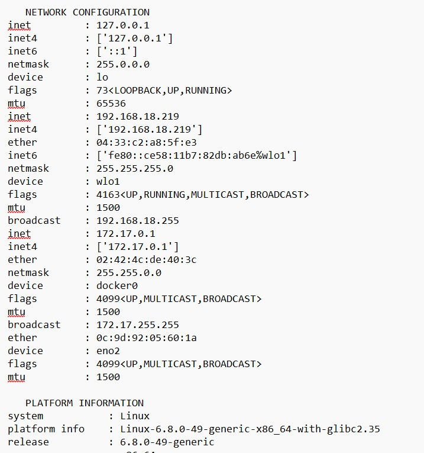

Polecenie doctor --report generuje szczegółowy raport diagnostyczny, zawierający konfigurację sieci (adresy IP, maski, MAC, MTU) oraz informacje o systemie operacyjnym (wersja jądra, platforma). Służy do diagnozy i weryfikacji środowiska.
# Zadanie 2 - Identyfikacja tematów sterowania i sensorów robota

## Sterowanie bazą robota
### `mobile_base_controller`
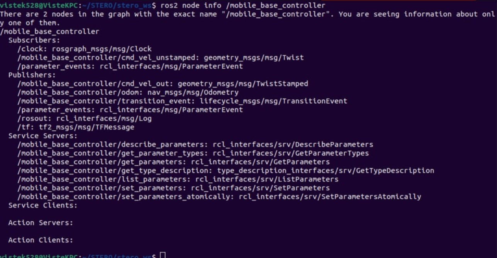

Sterowanie bazą robota w badanym systemie TIAGo odbywa się za pośrednictwem kontrolera `mobile_base_controller`. Subskrybuje tematy takie jak `/cmd_vel_unstamped` i `/clock`. Publikuje dane odometrii `/odom` oraz  transformacje `/tf`. Udostępnia serwisy zarządzania parametrami, takie jak ich opisywanie, pobieranie i ustawianie. Węzeł ten integruje sterowanie ruchem z systemem nawigacji i planowania.


### Sterowanie prędkością bazy
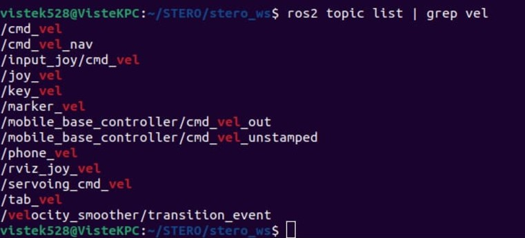

Sterowanie prędkością bazy mobilnej może odbywać się w różny sposób. Prędkość może być publikowana bezpośrednio na `/cmd_vel`, może pochodzić z joysticka - `/joy_vel`, klawiatury - `/key_vel` czy systemu nawigacji - `/cmd_vel_nav`. Przełączanie pomiędzy tymi tematami odbywa się z wykorzystaniem multipleksera zlokalizowanego w węźle `twist_mux`. Ostatecznie prędkość przekazywana jest do wcześniej omawianego kontrolera `/mobile_base_controller`.

## Odometria
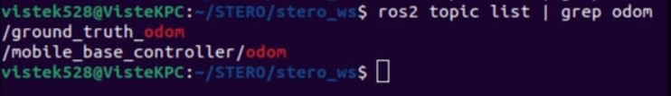

Odometria robota publikowana jest przez węzeł `/mobile_base_controller` na temat `/mobile_base_controller/odom`. Jest to odometria obliczona przez samego robota w symulowanym środowisku. Oprócz tego dostępny jest także temat `/groud_truth_odom`, na którym publikowana jest odometria powstała na podstawie pozycji robota wyciągniętej bezpośrendio z symulatora.


## Czujnik LiDAR
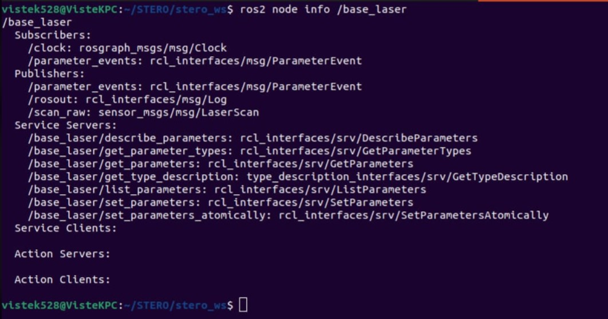

Węzeł `/base_laser` w ROS2 odpowiada za obsługę danych z LIDAR-u. Subskrybuje tematy takie jak /clock i /parameter_events, publikuje dane skanowania laserowego `/scan_raw` oraz udostępnia serwisy zarządzania parametrami (opis, pobieranie, ustawianie). Obsługuje skanowanie otoczenia, wspierając nawigację i unikanie przeszkód.

## Kamery RGB-D
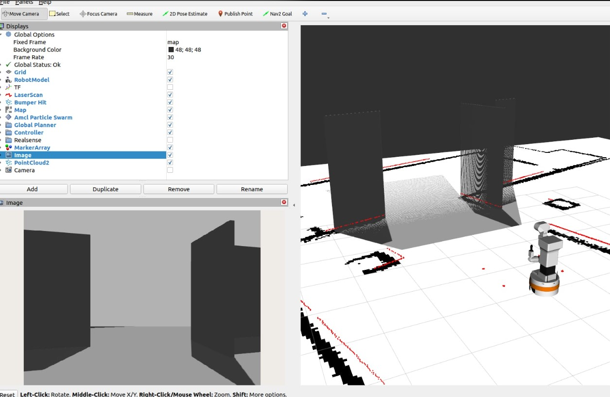

Robot TIAGo posiada także elementy wizyjne takie jak kamery RGB-D. Dane z niej publikowane są na temacie `/head_front_camera/rgb/image_raw` oraz `/head_front_camera/depth_registered/image_raw`. Na zdjęciu powyżej przedstawiono obraz z kamery głębi wyświetlony w wizualizacji w programie RViz.

# Zadanie 3
## Węzeł `pose_listener`

Pierwszym z zaimplementowanych zgodnie z poleceniem węzłów był węzeł `pose_listener`. Jego jedynym celem był nasłuch wiadomości odometrii publikowanych na temacie `/mobile_base_controller/odom`, aby następnie wypisać je do terminala. 


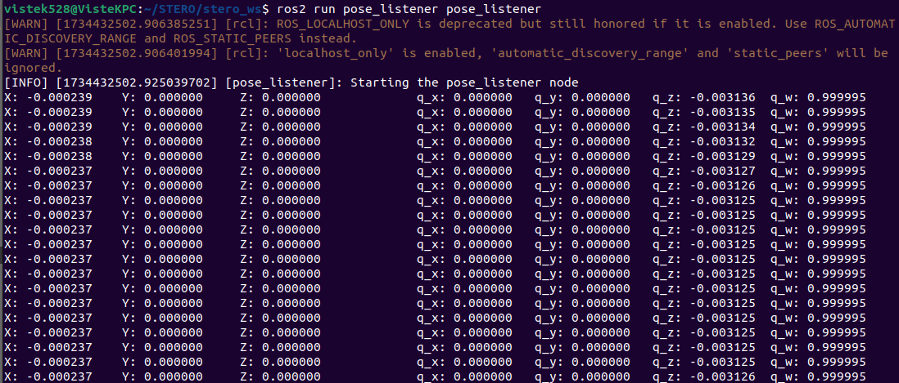

Na rysunku powyżej zaprezentowano rezultat uruchomienia węzła `pose_listener` dla nieruchomego robota TIAGo.

## Węzeł `shape_drawer_2`

Drugim węzełem, który miał być zaimplementowany w trakcie laboratorium był węzeł `shape_drawer_2`. Zadanie przez niego realizowane było już bardziej złożone i polegało na "narysowaniu" zadanej przez prowadzącego figury geometrycznej poprzez jazdę po jej obwodzie. Autorzy niniejszego sprawozdania mieli za zadanie narysować w trakcie laboratorium sześciokąt.

Tym razem oprócz subskrybcji tematu `/mobile_base_controller/odom` węzeł publikował sygnał sterujący dla bazy mobilnej na temacie `/cmd_vel`. 

Wydzielono dwa fragmenty kodu, zgodnie z zasadą DRY, które wielokrotnie powtarzały się w czasie wykonania zadania i były to:
- obrót do zadanego kąta `yaw`, będącego obrotem robota wokół osi OZ jego układu współrzędnych zgodnie z ruchem wskazówek zegara,
- jazda do przodu o określoną odległość `x`

### Obrót do zadanego kąta `yaw`
Do realizacji zadania obrotu zaimplementowano prosty regulator dwustanowy. Aktualna orientacja robota w stopniach była cały czas uaktualniana w odpowiednim callback'u i zapisywana do zmiennej `self._angle`. W momencie, gdy metoda `_rotate_angle` była wywoływana z argumentem `deg` uruchamiany był regulator, który dążył do osiągnięcia zadanej orientacji `deg` z określoną tolerancją. W momencie, gdy warunek ten został spełniony następowano wyjście z pętli.

```python
def _rotate_angle(self, deg):
    msg = Twist()

    while True:
        error = deg - self._angle
        if error > 180:
            error -= 360
        elif error < -180:
            error += 360

        if abs(error) < self._tolerance:
            self._publisher.publish(Twist())
            break

        angular_speed = 0.3
        msg.angular.z = angular_speed if error > 0 else -angular_speed
        self._publisher.publish(msg)
        time.sleep(0.01)
```

### Jazda o określoną odleglość `x`
W przypadku jazdy o zadaną odległość do przodu zadanie było jeszcze prostsze. Aktualne położenie robota tak samo jak orientacja uaktualniane są w odpowiednim callback'u i zapisywane są do zmiennych `self._x` oraz `self._y`.

Następnie w momencie wywołania funkcji `_drive_length` system zapisuje położenie robota na starcie wykonania ruchu i zadaje liniową prędkość dla bazy robota w osi `OX`. Prędkość ta utrzymywana jest tak długo jak spełniany jest warunek:

$$\sqrt{(x_s - x)^2 + (y_s - y)^2} < \text{meters}$$

```python
def _drive_length(self, meters):
    start_x = self._x
    start_y = self._y

    msg = Twist()
    msg.linear.x = 0.2

    while math.sqrt(pow(start_x - self._x, 2) + pow(start_y - self._y, 2)) < meters:
        self._publisher.publish(msg)
        time.sleep(0.01)

    self._publisher.publish(Twist())
```

### Główna pętla
Cały program został zapisany w metodzie `run`, która została przedstawiona poniżej:


```python
def run(self):
    self._rotate_angle(180)

    for i in range(1, 7):
        self._drive_length(1)

        rotation_angle = 180 - 60 * i
        if rotation_angle < 0:
            rotation_angle += 360
        self._rotate_angle(rotation_angle)

    self.get_logger().info("Finished")
```

Rezultat wykonania programu w postaci sześciokątu złożonego z danych publikowanych na temacie odometrii i wyświetlonych w programie RViz został przedstawiony poniżej:


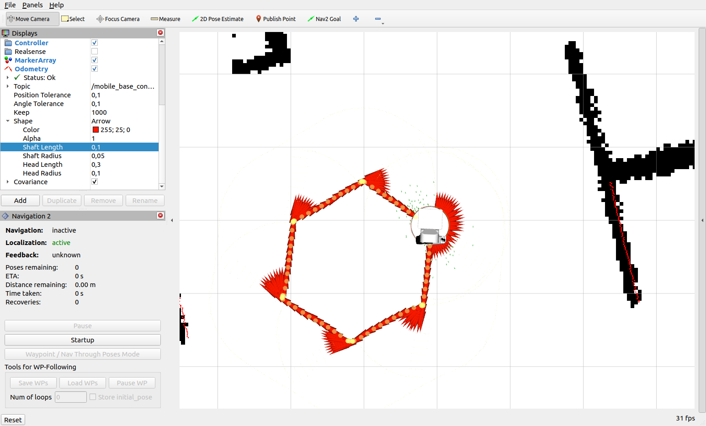