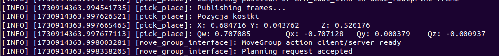
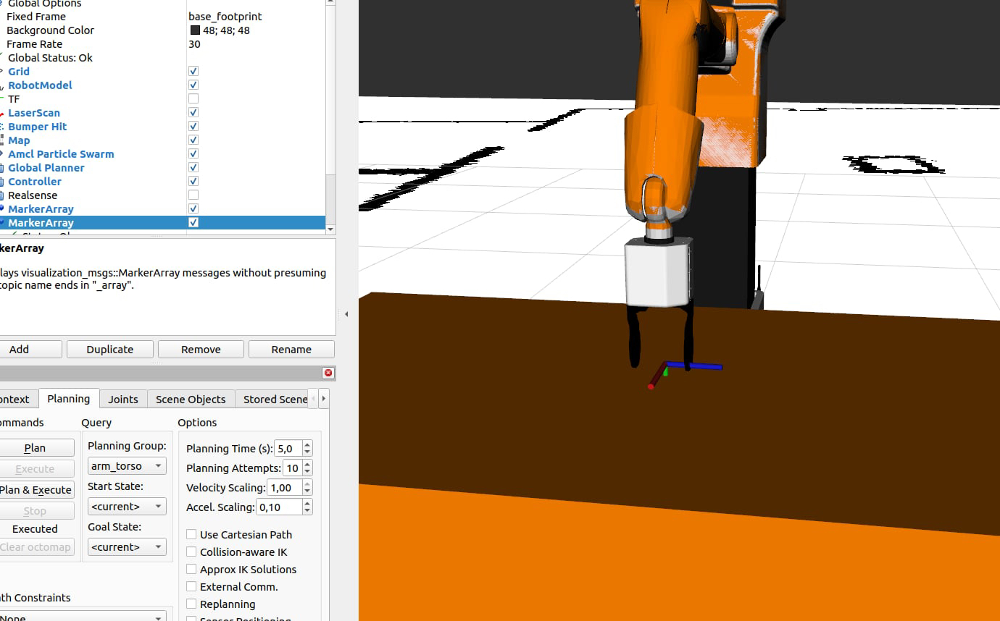
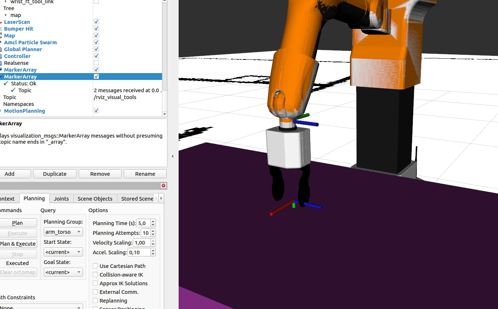
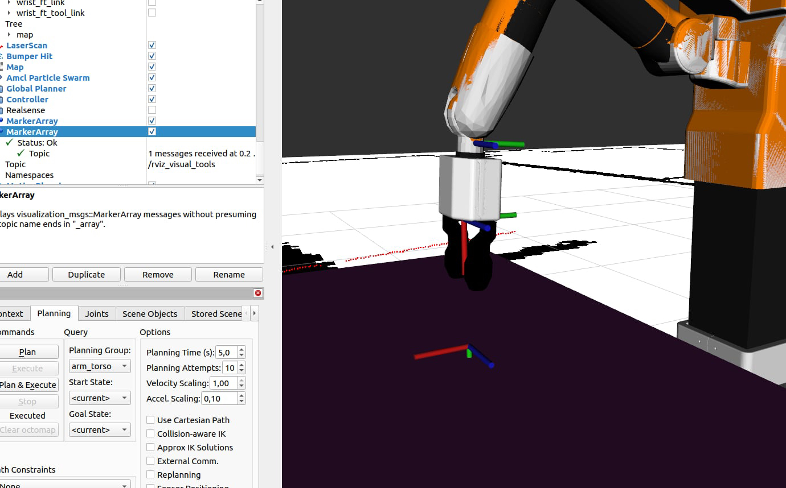

# Zadanie 1
Świat Gazebo wczytuje się z własnego pakietu, oraz wczytanie konfiguracji do rviz następuje z własnego pakietu.
# Zadanie 2
ros2 launch hello_moveit stero_tiago_gazebo.launch.py navigation:=True moveit:=True is_public_sim:=True world_name:=stero
# Zadanie 3
/gazebo_ros_state/world_states. Publikuje dane o stanie świata w symulacji, w tym pozycje i prędkości wszystkich obiektów. Można go użyć do monitorowania stanu symulacji w czasie rzeczywistym.

Serwisy:

/gazebo/set_model_state: Umożliwia ustawienie stanu modelu (typ: gazebo_msgs/GetModelState).

/gazebo/get_model_state: Zwraca aktualny stan modelu(typ: gazebo_msgs/GetModelState).

/gazebo/pause_physics: Pauzuje symulację
(typ: std_srvs/Empty).

/gazebo/unpause_physics: Wznawia symulację
(typ:std_srvs/Empty).

/gazebo/reset_world: Resetuje ś∑iat symulacji
(typ:std_srvs/Empty).

Te tematy i serwisy pozwalają monitorować stan symulacji oraz manipulować obiektami i sterować fizyką symulacji (pauza, wznowienie, reset).
# Zadanie 4
Dodano modele.
# Zadanie 5
B - bazowy układ (planning frame):

base_footprint

E - układ końcówki(end effector link):

arm_tool_link

F - układ związany z końcówką, którego pozycję można pobrać bezporednio w Gazebo:

arm_7_link

Pozycja układu F względem E:

Pozycja:
0; 0; 0; 0.046

0rientacja (kwaternion):
X = 0.5; Y = 0.5; Z = 0.5; W = -0.5

# Zadanie 6
Układ arm_7_link w odniesieniu do base_footprint:

Pozycja: X = 0.679767; Y = 0.0380681; Z = 0.805431

Orientacja: X = -0.0017812; Y = 0.999943; Z = 0.00218839;  W = 0.0103063
# Zadanie 7
Utworzono węzeł one_grasp , który pobiera pozycję obiektu green_cube_3 z symulatora za pomocą serwisu /get_entity_state. Pozycja obiektu jest wyświetlana w terminalu i wizualizowana w RViz za pomocą klasy MoveItVisualTools.
x : 0.684716
y : 0.043762
z : 0.520176
Qw : 0.707085
Qx : -0.707128
Qy : 0.000379
Qz : -0.000937

# Zadanie 8
W węźle one_grasp obliczyliśmy pozycję końcówki manipulatora, która jest wymagana do zaciśnięcia szczęk chwytaka na obiekcie. Pozycja ta została wyznaczona tak, aby umożliwić precyzyjne chwytanie obiektu przez manipulator. Następnie, przy użyciu RViz, wyświetliłem tę docelową pozycję w postaci układu współrzędnych, co można zaobserwować na załączonym zrzucie ekranu.

# Zadanie 9
W Zadaniu 9 wyznaczyliśmy i zwizualizowaliśmy w RViz pozycję końcówki manipulatora, którą należy osiągnąć przed wykonaniem chwytu, aby uniknąć kolizji z obiektem.

