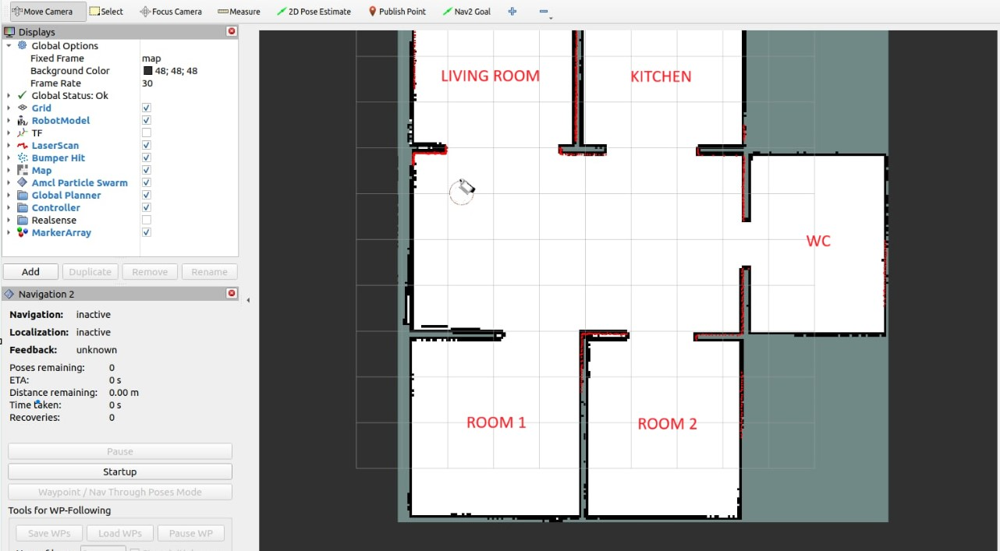
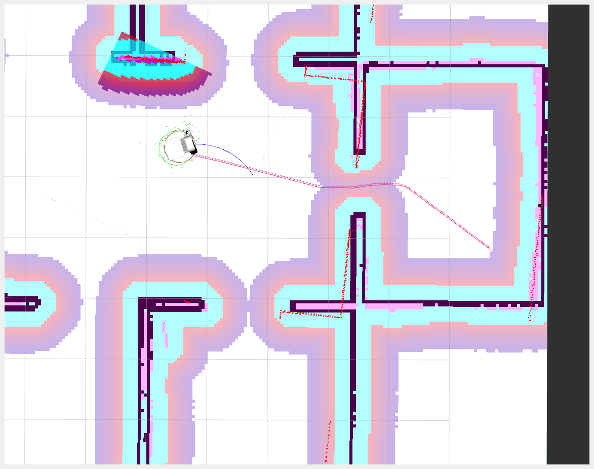
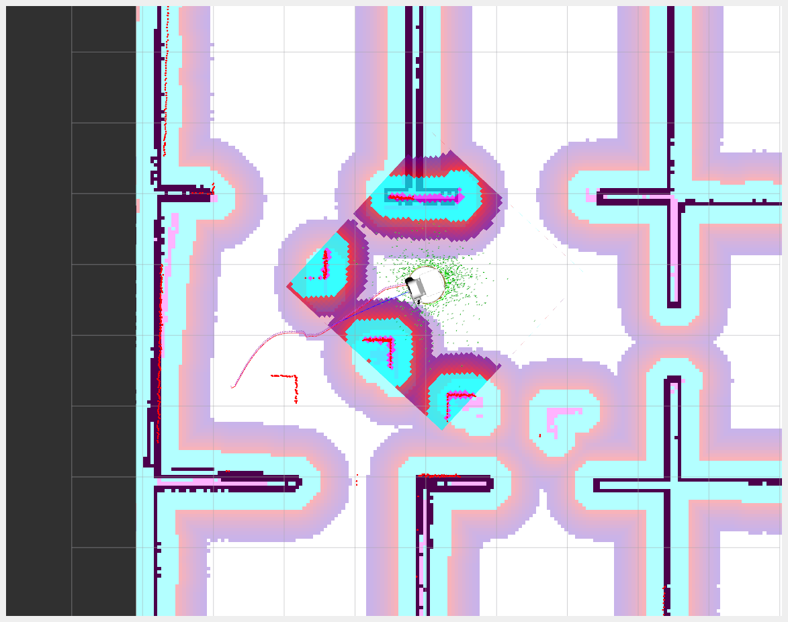
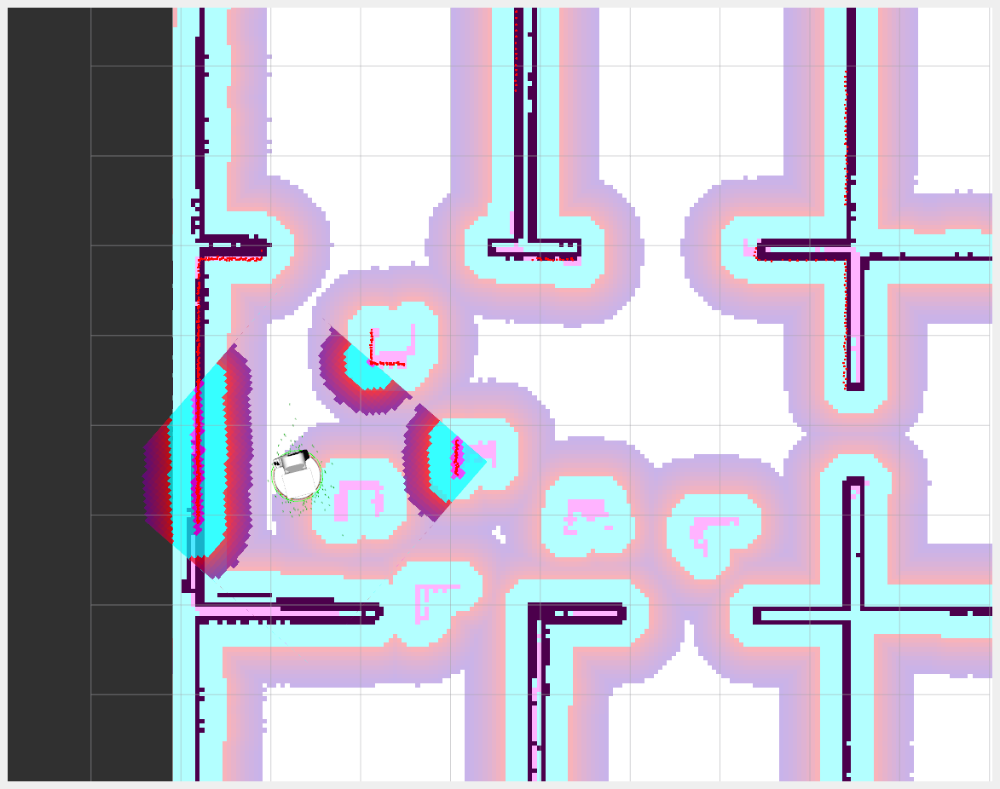

# SPRAWOZDANIE z laboratorium nr 5
* Piotr Patek 324879
* Kacper Bielak 324852

# Zadanie 1
Celem ćwiczenia było zaprojektowanie dwóch światów symulacyjnych w środowisku `gazebo`. Zaprojektowano następujące światy:
* `korytarz` - prosty świat symulujący wąskie, liniowe środowisko
* `mieszkanie2` - Bardziej złożony świat z wieloma pomieszczeniami i przejściami o różnej szerokości.


# Zadanie 2
Wyniki Realizacji:
* Identyfikacja pliku uruchamiającego Gazebo
W folderze ${HOME}/tiago odnaleziono plik, który bezpośrednio uruchamia symulator Gazebo. Plik ten został przeanalizowano, aby zrozumieć proces uruchamiania świata symulacyjnego.

* Stworzenie pliku uruchomieniowego `custom_world_launch.py` z argumentami `world_package` oraz `world_name`
Na podstawie zidentyfikowanego pliku stworzono własny plik uruchomieniowy w istniejącmy pakiecie `hello_moveit`. Plik ten umożliwia przekazanie argumentu `world_package`, który określa nazwę pakietu zawierającego plik świata symulacyjnego. Dodatkowo argument `world_name` określa, który świat z podanego pakietu ma zostać uruchomiony.

* Utworzenie pliku `stero_navigation_2.launch.py`
Na podstawie pliku `tiago_gazebo.launch.py` utworzono plik `stero_navigation.launch.py`. Plik ten wywołuje wcześniej stworzony plik uruchomieniowy z kroku 2, zamiast pliku uruchamianego przez konfigurację Tiago. Dzięki temu możliwe jest uruchamianie symulacji z własnymi światami.

# Zadanie 3
Do komendy został dodany parametr `slam:=True`

Pełna komenda:
```bash
ros2 launch hello_moveit stero_navigation_2.launch.py is_public_sim:=True navigation:=True world_package:=hello_moveit world_name:=mieszkanie2 moveit:=True slam:=True
```


# Zadanie 4
Zadanie czwarte polegało na sterowaniu robotem w celu zbudowania kompletnej mapy środowiska.
W tym celu poruszano się robotem z wykorzystaniem sterowania prędkościowego zadawanego poprzez klawiaturę po mieszkaniu utworzonym w zadaniu 1. Poniżej przedstawiono kolejne kroki budowania mapy świata `mieszkanie2`.



# Zadanie 5
Mapa została zapisana w pliku `map.pgm` oraz `map.yaml`
# Zadanie 6
W ramach ostatniego zadania należało napisać własny węzeł, który z wykorzystaniem akcji `NavigateToPose` umożliwi badania systemu nawigacji robota TIAGo. 
W tym celu stworzono węzeł `nav_tester`. Dla każdego pokoju wyznaczono 3 różne lokalizacje (łatwą, normalną i trudną). 

System można było uruchomić z wykorzystaniem komendy
```bash
ros2 run nav_tester nav_tester --ros-args -p room_name:=<destinantion_room> -p difficutly:=<"easy"|"normal"|"hard">
```
Przykładowa komenda:
```bash
ros2 run nav_tester nav_tester --ros-args -p room_name:="living_room" -p difficutly:="easy"
```

Przykładowe wyjście systemu:
```bash
vistek528@VisteKPC:~/STERO/stero_ws$ ros2 run nav_tester nav_tester --ros-args -p room_name:="corridor" -p difficutly:="easy"
[WARN] [1735755197.348896357] [rcl]: ROS_LOCALHOST_ONLY is deprecated but still honored if it is enabled. Use ROS_AUTOMATIC_DISCOVERY_RANGE and ROS_STATIC_PEERS instead.
[WARN] [1735755197.348916455] [rcl]: 'localhost_only' is enabled, 'automatic_discovery_range' and 'static_peers' will be ignored.
[INFO] [1735755197.560645624] [NavTester]: Starting move...
[INFO] [1735755197.561236817] [NavTester]: Selected move to room: corridor
[INFO] [1735755197.561724105] [NavTester]: Selected difficulty: easy
[INFO] [1735755197.562209891] [NavTester]: Destination coordinates (X,Y) = (0.00,0.00)
[INFO] [1735755198.810725571] [NavTester]: Goal accepted :)
[INFO] [1735755199.051604150] [NavTester]: Desired pose achieved!
[INFO] [1735755199.054081937] [NavTester]: Move finished successfully!
```

## Badane parametry
Dla mapy globalnej badano zmianę takich parametrów jak:
- `inflation_radius`
- `update_frequency`
- `robot_radius`

Dla mapy globalnej badano zmianę takich parametrów jak:
- `inflation_radius`
- `resolution`
- `robot_radius`

Testowane drzewa zachowań:
- `navigate_to_pose_w_replanning_and_recovery.xml`
- `navigate_w_replanning_distance.xml`
- `navigate_w_replanning_speed.xml`
- `navigate_w_replanning_only_if_path_becomes_invalid.xml`


## Wykonane zadania
### Jazda do pozycji `kitchen` z trudnością `easy`


### Jazda do pozycji `wc` z trudnością `normal`


### Jazda do pozycji `room1` z trudnością `easy`


### Jazda do pozycji `room1` z trudnością `hard` (normalne "nadmuchanie" mapy globalnej)


### Jazda do pozycji `room1` z trudnością `hard` (zwiększone "nadmuchanie" mapy globalnej)


### Jazda do drugiego rogu pomieszczenia z dodaniem przeszkód
Zgodnie z poleceniem zrealizowano zadanie jazdy do drugiego rogu pomieszczenia z dodaniem przeszkód po drodze. 
Jak można zauważyć na zdjęciach poniżej, na początku robot posiadał jedynie wiedzę o otoczeniu wynikającą z dotychczas stworzonej mapy globalnej.
Nie było na niej zaznaczonych przeszkód, które nie były dodane na etapie tworzenia mapy.
Z tego powodu pierwotna ścieżka została stworzona jako lista prosta.
Po obrocie robota na mapie lokalnej pojawiły się przeszkody - trasa została zmieniona,
a mapa globalna zaktualizowana. W trakcie wykonania zadania robot ciągle modyfikował trasę tak,
aby dotrzeć do celu zwracając uwagę na otaczające go przeszkody.




