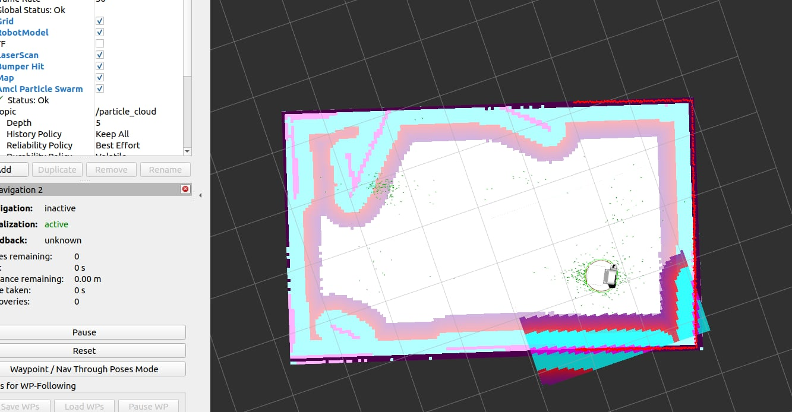
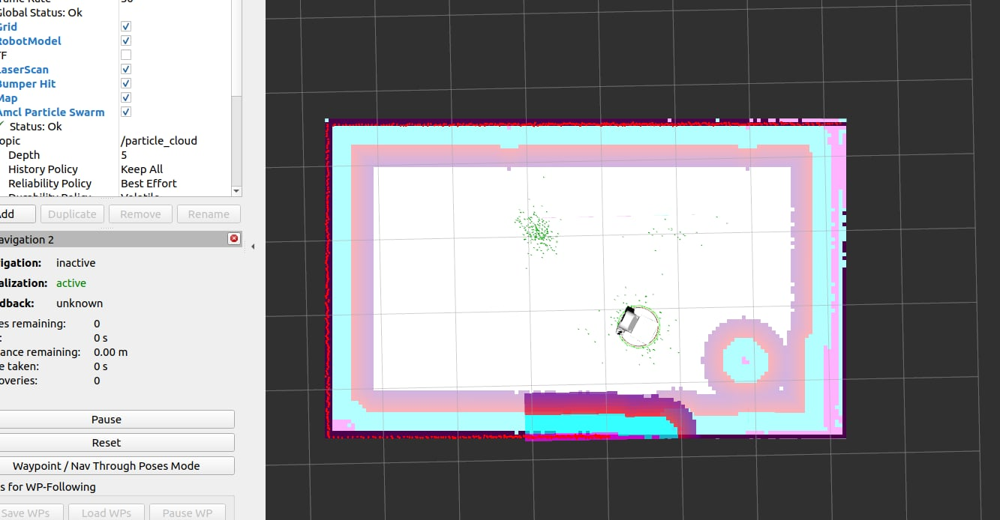
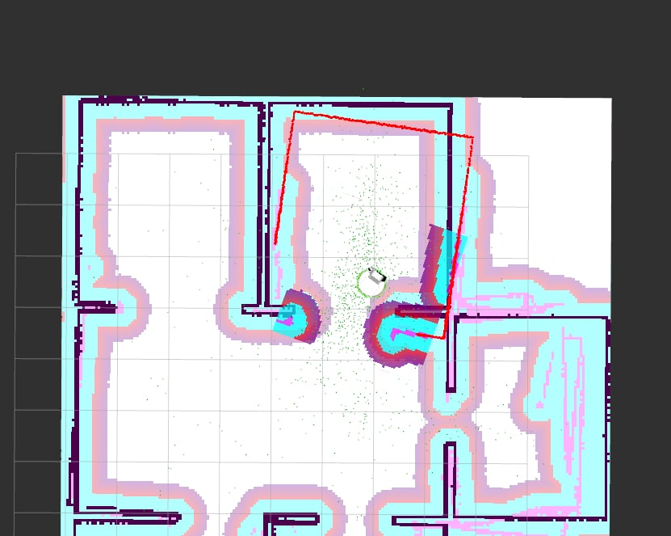
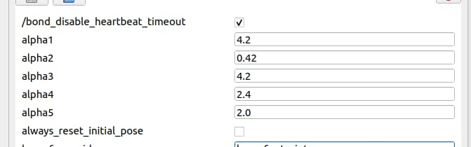

# SPRAWOZDANIE 
* Piotr Patek 324879
* Kacper Bielak 324852
# Zadanie 1
Mini wykład o lokalizacji globalnej.
# Zadamie 2
Badanie lokalizacji globalnej w świecie "korytarz".

Zielone punkty na obrazie reprezentują chmurę cząsteczek (particle cloud) generowaną przez algorytm AMCL (Filtr cząsteczkowy używany do estymacji lokalizacji robota potrzebnej w zadaniu nawigacji). Punkty te wskazują potencjalne lokalizacje robota w środowisku, a ich rozmieszczenie odzwierciedla prawdopodobieństwo, z jakim robot może znajdować się w danym miejscu. Gęstsze skupiska punktów oznaczają większe prawdopodobieństwo lokalizacji robota, a ich rozmieszczenie zmienia się dynamicznie w miarę przetwarzania danych z sensorów i dopasowywania ich do mapy środowiska.
# Zadanie 3
Badanie parametrów AMCL w świecie "mieszkanie" za pomocą narzędzia "rqt_reconfigure".

Poprzez dostosowywanie parametrów AMCL, można poprawiać lub pogarszać dokładność estymacji pozycji robota w zależności od charakterystyki środowiska oraz sposobu poruszania się robota. Wyższe wartości parametrów (np. alpha1, alpha3) mogą powodować większy rozrzut chmury punktów (niższa dokładność), co widoczne jest na mapie. To badanie pozwala lepiej zrozumieć działanie algorytmu lokalizacji oraz umożliwia jego optymalizację dla konkretnego środowiska.
* Alpha 1 - Oczekiwany szum procesowy w rotacji odometrii oszacowany z rotacji.
* Alpha 2 -  Oczekiwany szum procesowy w rotacji odometrii oszacowany z translacji.
* Alpha 3 - Oczekiwany szum procesowy w translacji odometrii oszacowany z translacji.
* Alpha 4 - Oczekiwany szum procesowy w translacji odometrii oszacowaniu z rotacji.
* Alpha 5 - Oczekiwany szum procesowy w translacji odometrii oszacowaniu z rotacji.

# Zadanie 4
Prezentacja projektu 1 i 2:

Projekty zostały zaprezentowane prowadzącemu dnia 16.01.2025.

