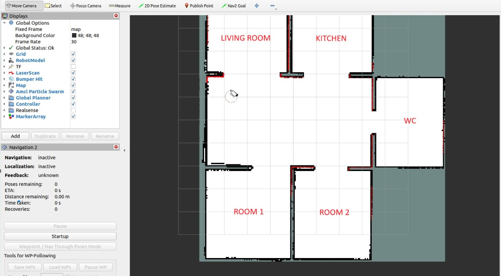
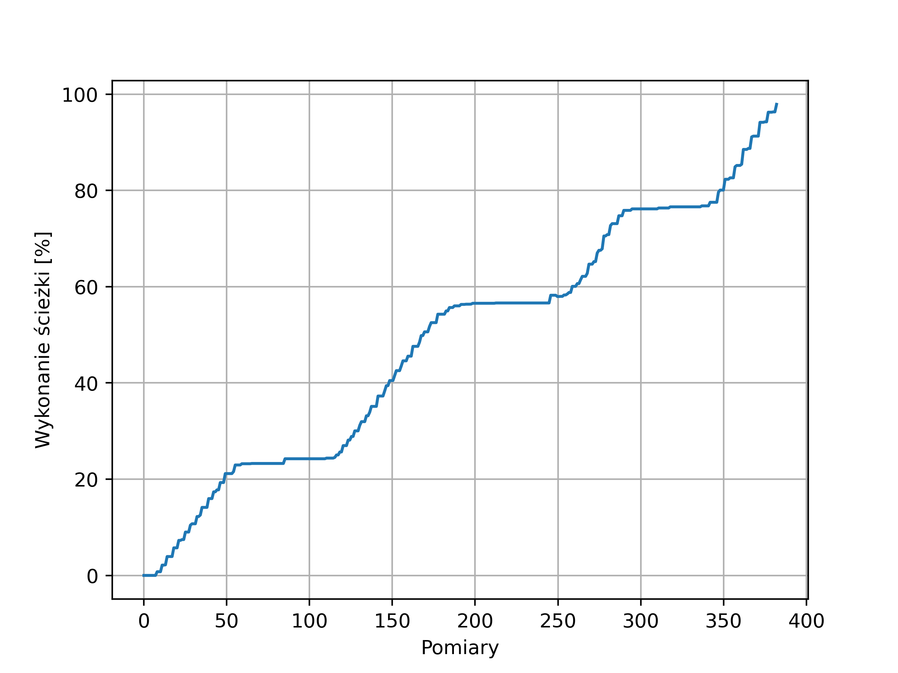
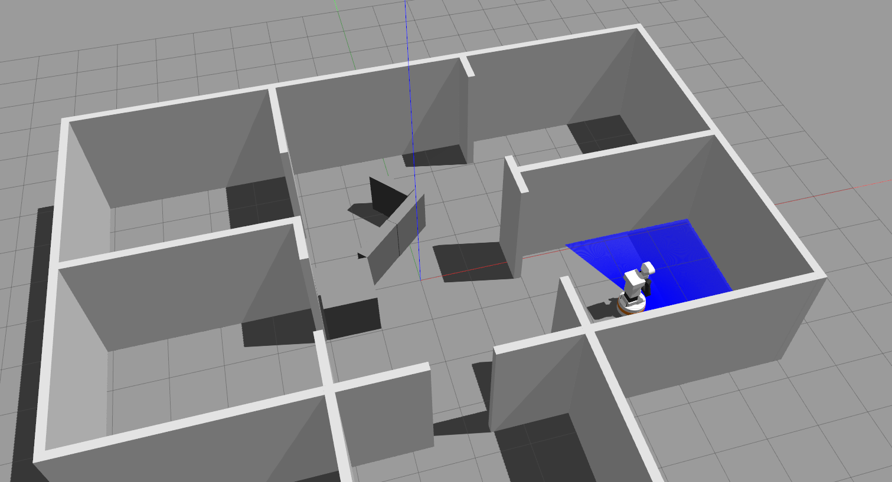
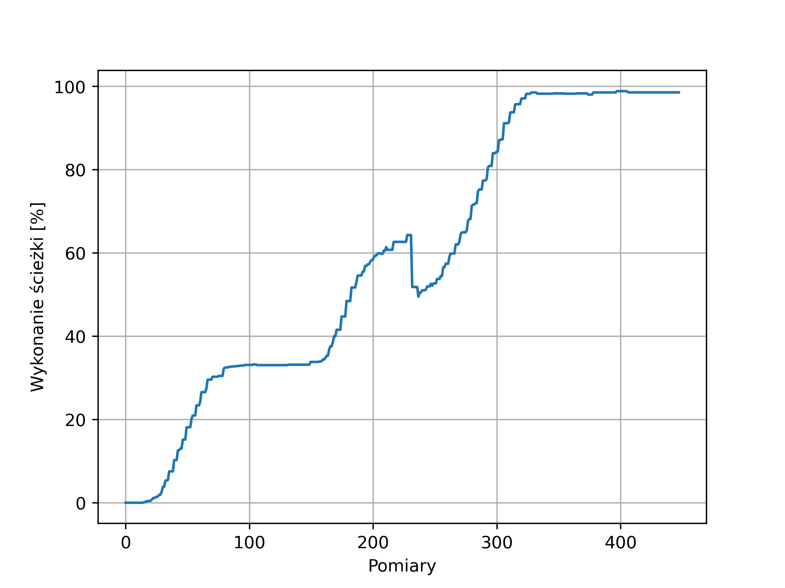

# STERO, Sprawozdanie z projektu nr 3
* Piotr Patek 324879
* Kacper Bielak 324852

# Zadanie
W ramach projektu nr 3 należało napisać własny węzeł ROS2, który udostępniałby akcję umożliwiajacą na zadawanie ruchu robota TIAGo przez listę punktów. Dodatkowo w trakcie wykonywania zadania, akcja powinna zwracać feedback z % wykonania trasy (uwzględniając przy tym przeszkody). W trakcie wykonywania obrotu robot powinien obrócić swoją głowę w kierunku zgodnym z kierunkiem obrotu bazy mobilnej.

# Implementacja
W ramach projektu stworzono 2 różne pakiety:
- `waypoint_folloer` - węzły `WaypointFollowerServer` i `WaypointFollowerClient`
- `stero_nav_msgs` - pakiet zawierający definicję akcji `SteroNavWaypointFollow.action` stworzonej na potrzeby projektu

## Akcja `SteroNavWaypointFollow.action`
Aby móc zrealizować założenia postawione w treści zadania stworzono własny typ akcji - `SteroNavWaypointFollow.action`, który posiada następujące pola:

```txt
std_msgs/Header header
geometry_msgs/Point[] waypoints
---
int32 status
---
float64 percentage_completed
```
## Węzeł `WaypointFollowerServer`
Węzeł `WaypointFollowerServer` stworzony na potrzeby zadania wykorzystywał Simple Api Commander do komunikacji z systemem nawigacji robota TIAGo. Ruch do listy punktów wykonywany był z użyciem metody `followWaypoints`. Zakłada ona w przeciwieństwie do podobnej metody `goThroughPoses`, że robot musi osiągnąć zadane pozycje, a nie tylko przejechać w ich pobliżu. Efektem takiego podejścia jest generacja ścieżki etapaki, od punktu do punktu, a nie na całej długości od razu. Wprowadza to dodatkowe utrudnienie do mechanizmu szacowania % wykonania ścieżki, o czym więcej w następnym podrozdziale.

### Obliczanie % wykonania trasy
Szacowanie % wykonania trasy zostało wykonane poprzez podział odcinków ścieżki na 3 różne typy:
1. Ścieżki już wykonane - robot przejechał już te odcinki, a więc doskonale wiemy jakie były pozycje robota w kolejnych chwilach czasu i możemy na tej podstawie obliczyć jej długość.
2. Ścieżka aktualnie wykonywana - robot jest w trakcie wykonania tej ścieżki, a więc składa się ona z części już przejechanej, a także tej którą musi jeszcze przejechać i która jest na bieżąco modyfikowana przez planner globalny w razie potrzeby.
3. Ścieżki do wykonania - robot jeszcze nie rozpoczął tych odcinków, a więc ich długość jest jedynie szacunkiem powstałym na podstawie mapy globalnej, którą dysponuje robot.


$$\text{percentage\_completed}=\frac{\sum_{i=0}^kh[i] + u}{\sum_{i=0}^kh[i] + u + g + \sum_{i=k}^Nz[i]}$$

gdzie:
- $h$ - tablica zawierająca długości juz przejechanych ścieżek (z wyłączeniem obecnie wykonywanej)
- $z$ - tablica zawierająca długości scieżek do przejechania (z wyłączeniem obecnie wykonywanej)
- $u$ - odległość przejechana w ramach obecnie wykonywanej ścieżki
- $g$ - odległość do przejechania w ramach obecnie wykonywanej ścieżki (z plannera)

Długość pojedyńczej ścieżki o $N$ punktach obliczana jest jako odległość pomiędzy kolejnymi jej punktami:

$$d = \sum_{i=1}^N\sqrt{(p_x[i]-p_x[i-1])^2 + (p_y[i]-p_y[i-1])^2}$$

## Struktura
Węzeł jako taki składa się z 5 zadań, które wykonywane są równolegle. Są to:
- `serwer akcji` - obsługuje zapytania na `/stero_nav_waypoint` wysyłając żądanie ruchu do zbioru podanych punktów w ramach trasy, zwraca % wykonania trasy jako feedback
- `PoseUpdateCallback` - callback w ramach którego zapisywana jest informacja o obecnym położeniu robota
- `PathUpdateCallback` - callback w ramach którego zapisywana jest obecna ścieżka, jeżeli została na nowo wyznaczona
- `ControlHeadCallback` - callback, który wyzwalany jest z częstotliwością $f=1\text{Hz}$. Wysyła żądania ruchu głowy robota w zależności od ostatniej zapisanej prędkości kątowej bazy robota.
- `VelocityUpdateCallback` - callback w ramach którego zapisywana jest informacja o obecnej prędkości bazy mobilnej robota.

Zadania te zostały przedstawione poniżej na diagramie akcji:


### Obrót głowy robota
Zgodnie z założeniem w przypadku w którym robot wykonywałby obrót jego głowa miała się zwracać w kierunku zgodnym z kierunkiem obrotu bazy mobilnej. W tym celu zaimplementowany węzeł subskrybował temat `/mobile_base_controller/cmd_vel_unstamped`, z którego pobierał informację na temat prędkości kątowej jaka jest zadana dla bazy mobilnej. Następnie z wykorzystaniem tej informacji wysyłane było żądanie do kontrolera głowy robota, aby wykonał jej obrót do zadanej orientacji w następujący sposób:
- dla prędkości kątowej większej lub równej $0.2$ rad/s, a więc obrotu w kierunku przeciwnym do ruchu wskazówek zegara, głowa miała ustawić się na kącie 45 stopni,
- dla prędkości kątowej większej lub równej $-0.2$ rad/s, a więc obrotu w kierunku zgodnym do ruchu wskazówek zegara, głowa miała ustawić się na kącie -45 stopni,
- dla prędkości kątowej z zakresu $-0.2 <= \omega <= 0.2$ głowa miała był ustawiona prosto

Diagram akcji dla systemu zadawania orientacji głowy robota został zaprezentowany poniżej:


### Serwer akcji
Głównym elementem zaimplementowanego węzła był serwer akcji dzięki któremu możliwe było zadanie ruchu przez zbiór punktów i przekazywanie postępów w wykonaniu zadania na bieżąco. Diagram akcji przedstawiający działanie serwera akcji został przedstawiony poniżej:


Jak można zauważyć, na początk serwer czeka na otrzymanie zadania. Następnie jeżeli liczba punktów do których robot ma się nawigować jest większa od 0 następuje zainicjalizowanie odpowiednich zmiennych i oczekiwanie na system nawigacji, aż stanie się dostępny. Potem serwer dokonuje estymacji długości poszczególnych odcinków ścieżki z wykorzystaniem planera. Gdy zadanie to zostanie ukończone, zbiór punktów do osiągnięcia jest przekazywany do systemu nawigacji w celu wykonania. W trakcie, gdy system nawigacji przemieszcza robota pomiędzy punktami, na bieżąco dokonywana jest estymacja % wykonania całej trasy z wykorzystaniem informacji takich jak: obecne i przeszłe położenia, aktualna ścieżka wyznaczona przez planner i przewidywane ścieżki pomiędzy kolejnymi punktami trasy. Gdy robot dojedzie do ostatniego z zadanych punktów i zadanie zostanie zakończone lub zostanie ono przerwane do klienta wysyłany jest rezultat wykonania akcji, a sam serwer przechodzi znów w stan oczekiwania.

# Testy
Testy zaimplementowanego węzła przeprowadzono w świecie `mieszkanie2` stworzonym na potrzeby zajęć laboratoryjnych nr 5. Poniżej na przypomnienia przedstawiono mapę mieszkania:




Ruch zadawany był z wykorzystaniem węzła `WaypointFollowerClient`, ale możliwe jest także zadawanie ruchu z poziomu terminala z wykorzystaniem komendy. Poniżej została przedstawiona przykładowa komenda wywołująca akcję.

```bash
ros2 action send_goal /stero_nav_waypoint stero_nav_msgs/action/SteroNavWaypointFollow "{waypoints: [{x: 0.0, y: 0.0, z: 0.0}, {x: 0.75, y: -2.4, z: 0.0}, {x: 4.0, y: -1.7, z: 0.0}]}"
```

Aby dostawać na bieżąco informację o postępie wykonania zadania należy dodać flagę `--feedback`

```bash
ros2 action send_goal /stero_nav_waypoint stero_nav_msgs/action/SteroNavWaypointFollow "{waypoints: [{x: 0.0, y: 0.0, z: 0.0}, {x: 0.75, y: -2.4, z: 0.0}, {x: 4.0, y: -1.7, z: 0.0}]}" --feedback
```

## Ruch pomiędzy do 4 punktów
Pierwszym z testowanych scenariuszy był ruch z pokoju 1 do następujących lokalizacji:
- środek korytarza - punkt $(0, 0)$
- toaleta - punkt $(0, -5.2)$
- prawy góry róg korytarza - punkt $(0.75, -2.4)$
- kuchnia - punkt $(4.0, -1.7)$

Poniżej przedstawiono wykres ukazujący % wykonania trasy dla tak zdefiniowanego zadania:



Jak można zauważyć, ścieżka wykonywana jest etapami, a przyrost wykonania ścieżki nie jest liniowy. Nie jest to nic dziwnego, ponieważ po osiągnięciu zadanego położenia robot koryguje także swoja orientację (q=(0, 0, 0, 1)) i zajmuje to pewien czas. Widoczny jest także drugi problem, a mianowicie robot nie osiąga do końca wartości 100% wykonania ścieżki. Dzieje się tak, ponieważ kontroler bazy mobilnej robota ma ustawioną bardzo niską tolerancję wykonania zadania i wynosi ona $0.25$, zarówno dla położenia w osiach OX i OY, a także orientacjiw radianach ($0.25$ rad to aż $14.32$ stopnia). Poza tym system sprawdza się bardzo dobrze.


## Ruch do 2 punktów z przeszkodami
W drugim z rozważanych scenariuszy założono ruch z kuchni do 2 punktów:
- prawy góry róg korytarza - punkt $(0.75, -2.4)$
- środek korytarza - punkt $(0, 0)$
- pokój1 - punkt $(-4.0, 1.7)$

Jednakże tym razem system na etapie planowania zadania nie wiedział, że w świecie na wyznaczonej ścieżce pojawiły się przeszkody w postaciu sześciokątnych pudeł. Przedstawiono je na rysunku poniżej:



Tym razem wykres ukazujący % wykonania trasy dla tak zdefiniowanego zadania wyglądał następująco:



To co można na nim zauważyć to fakt, że po tym jak system zauważył przeszkodę i wyznaczył nową ścieżkę próbując ją ominąć, a więc wydłużył pierwotną trasę to i procent wykonania całej ścieżki spadł z szacowanych ponad 60% do około 50%. 


