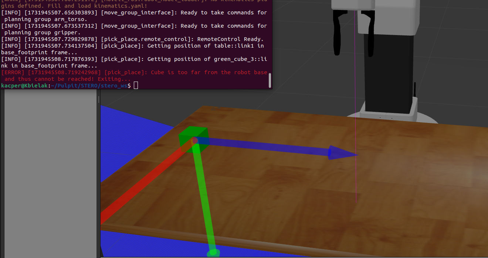
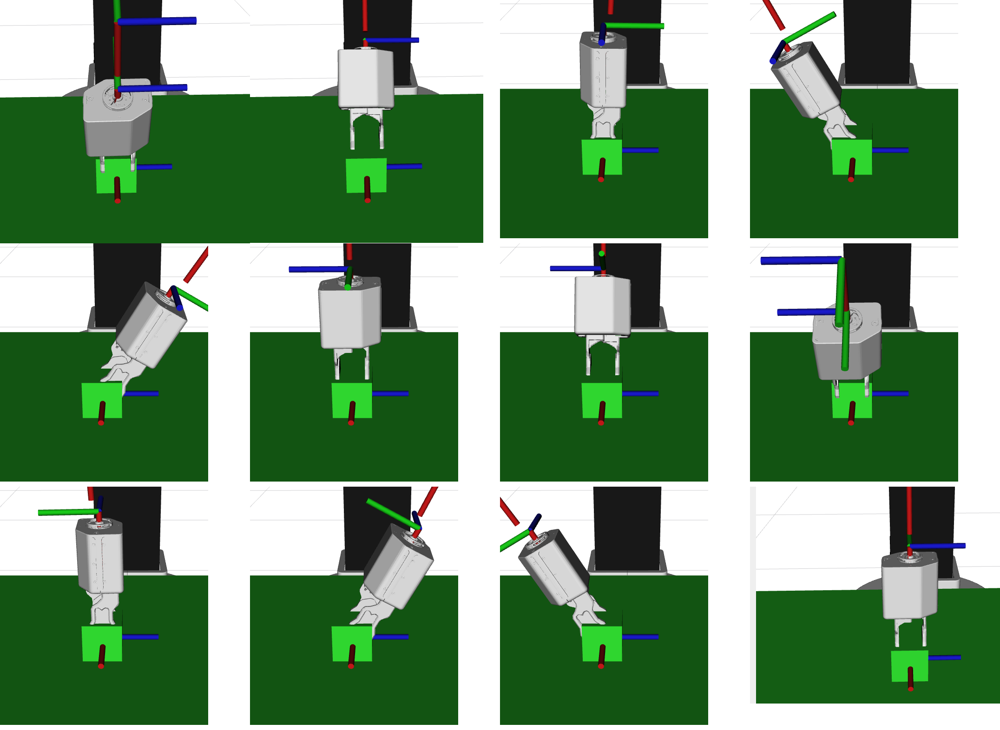
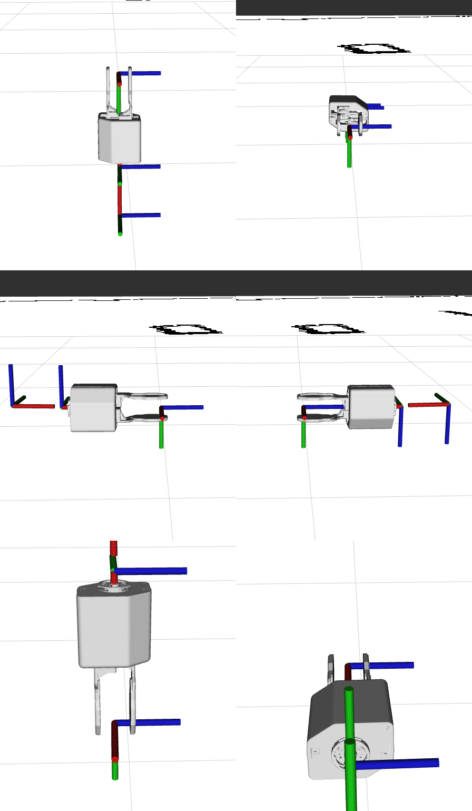
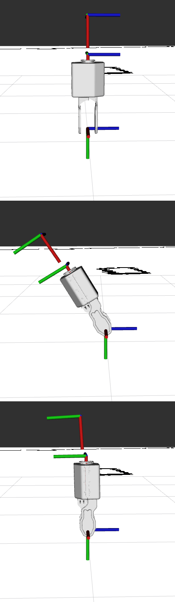

# Zadanie 1
Zadanie 1 zostało wykonane pomyślnie. Utworzyłem przestrzeń pracy tiago na podkładce /opt/ros/iron oraz przestrzeń pracy stero na podkładce tiago. W przestrzeni pracy stero znajdują się pakiety utworzone w ramach laboratorium 1 i 2, zgodnie z wymaganiami.

# Zadanie 2
Węzeł pick_place został napisany na podstawie węzła one_grasp z laboratorium 2. Węzeł realizuje funkcję chwytania obiektu green_cube_3, unosi go na wysokość 5 cm nad stół i odkłada w inne miejsce, zachowując odwróconą współrzędną Y, aby osiągnąć przesunięcie bez zmiany orientacji. W przypadku, gdy chwytanie obiektu jest niemożliwe, węzeł wyświetla odpowiedni komunikat i kończy działanie bez błędu.

# Zadanie 3 
Wynik zadania został zaprezentowany prowadzącemu laboratoria, który podtwierdził wykonanie zadania. Zdjęcia przedstawiają poprawne działanie kodu oraz błąd w sytuacji błędnego ustawienia kostki:

# Zadanie 4 
Oto wszystkie obroty w celu wyznaczenia chwytów
# Zadanie 5
Węzeł show_side_grasps został napisany zgodnie z wytycznymi. Węzeł wyświetla za pomocą markerów w RViz oraz metod publishAxis() i publishGrasps() trzy chwytaki, pokazując każdy chwyt osobno, aż do naciśnięcia przycisku „Next” (lub „Break”, co kończy działanie programu). Dla każdego chwytu wyświetlane są: model chwytaka, układ związany z chwytakiem (dla pozycji chwytu i przed chwytem) oraz układ związany z obiektem.
Zdjęcia ekranu z RViz, które dokumentują każdy chwyt:

# Zadanie 6
 Chwyty zozstały wyznaczone i zaprezentowane prowadzącemu.
# Zadanie 7 
Węzeł show_all_grasps został napisany na podstawie węzła show_side_grasps. Węzeł wyświetla wszystkie wyznaczone chwytaki, pokazując łącznie 6 chwytów w RViz. W raporcie umieszczono zrzuty ekranu z RViz, które przedstawiają po jednym chwycie dla każdej ścianki.

# Zadanie 8
Węzeł show_selected_grasps został utworzony na podstawie węzła show_all_grasps. Węzeł wybiera i wyświetla chwytaki dla obiektu green_cube_3, które mają największą szansę powodzenia, czyli są skierowane „od góry”.

# Zadanie 9
Węzeł pick_place_robust został opracowany na podstawie węzła pick_place. Węzeł realizuje to samo zadanie co pick_place, ale dodatkowo próbuje chwytania obiektu green_cube_3 kolejnymi chwytami, zgodnie z procedurą opisaną w Zadaniu 7. Dzięki temu jest w stanie podnieść obiekt niezależnie od ścianek, na których leży.
 # Zadanie 10
  Węzeł tower_2 został napisany na podstawie węzła pick_place_robust. Realizuje on zadanie układania wieży z dwóch klocków: green_cube_2 jako górny element oraz green_cube_3 jako dolny. Węzeł zapewnia poprawne ułożenie tych klocków jeden na drugim.
# Zadanie 11
W zadaniu 11 rozszerzono funkcjonalność węzła tower_2 do węzła tower_3, umożliwiając ułożenie wieży z trzech klocków: green_cube_1, green_cube_2 i green_cube_3. Implementacja wykorzystała rozwiązanie z zadania 10, wprowadzając obsługę dodatkowego klocka, co wymagało uwzględnienia jednej dodatkowej operacji chwytania i ustawiania.
